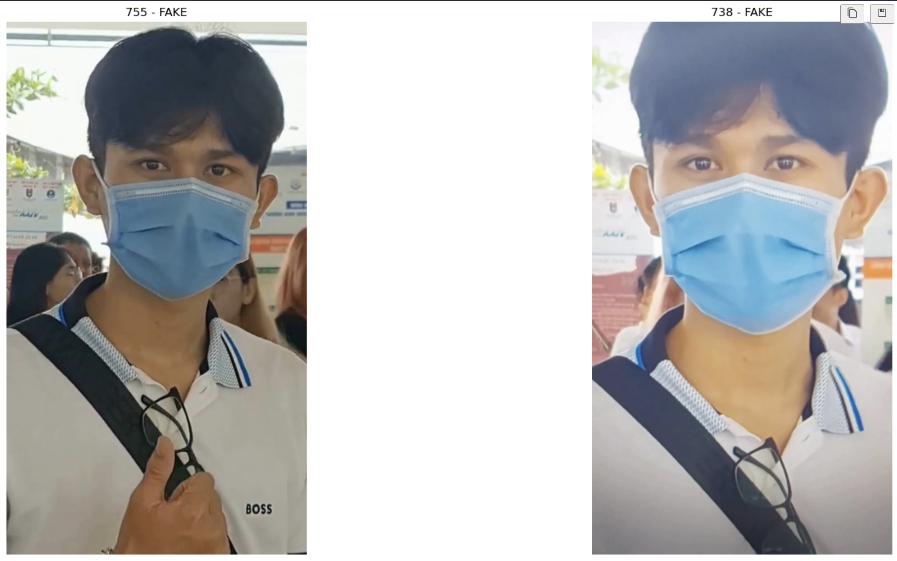

# Liveness detection

A strong baseline for liveness detection. The challenge is a part of the [ZaloAI Challenge Series](https://challenge.zalo.ai/), a series of challenges organized by ZaloAI to promote AI research in Vietnam. The source code could be used for similar tasks, such as face anti-spoofing or detecting fake videos.


<!-- add image here -->
## Table of Contents
<!-- table of content of this file -->
- [Problem statement](#problem-statement)
- [Feature collection](#features)
- [Environment setup guide](#environment)
- [Data preparation](#data-preparation)
- [Model training and evaluation](#training-evaluation-and-inference)
- [Docker](#docker)


## Problem statement

In verification services related to face recognition (such as eKYC and face access control), the key question is whether the input face video is real (from a live person present at the point of capture), or fake (from a spoof artifact or lifeless body). Liveness detection is the AI problem to answer that question.

In this challenge, participants will build a liveness detection model to classify if a given facial video is real or spoofed.

- Input: a video of selfie/portrait face with a length of 1-5 seconds (you can use any frames you like).

- Output: Liveness score in [0...1] (0 = Fake, 1 = Real).

Example Output: Predict.csv

| fname        | liveness_score |
|--------------|----------------|
| VideoID.mp4  | 0.10372        |
| ,,,          | ...            |
| ,,,          | ...            |
| ,,,          | ...            |


## Features

Currently, the following features are supported:

- [x] Training and evaluation code for liveness detection, frame-level classification / face-level classification.
- [x] Support for training on multiple GPUs.
- [x] Automatic mixed precision training.
- [x] Auto find best learning rate.
- [x] Support EfficientNet, ViT, etc.
- [x] Manage experiments with [Weights & Biases](https://wandb.ai/site).
- [x] Code management with registry, config, and logging.
- [x] Dockerfile for deployment.
- [x] Unit tests.
- [x] Packaging available.
- [x] Support semi-supervised learning on external unlabeled data.

In the future, we will add more features, such as:

- [ ] Command-line interface.
- [ ] New config system with [Hydra](https://hydra.cc/).
- [ ] New package management system with [Poetry](https://python-poetry.org/).
- [ ] Cloud training with [DVC](https://dvc.org/) and [AWS](https://aws.amazon.com/).
- [ ] Testing with [CML](https://cml.dev/).
- [ ] Support ensemble models, such as [Stacking](https://scikit-learn.org/stable/modules/ensemble.html#stacking), [Blending](https://scikit-learn.org/stable/modules/ensemble.html#blending) or [Model Soup](https://github.com/mlfoundations/model-soups).
- [ ] Support fine-tuning as a module.
- [ ] More learning strategies, such as [Decoupled Knowledge Distillation](https://github.com/megvii-research/mdistiller)
- [ ] Hyperparameter optimization with [Optuna](https://optuna.org/).

If you have any suggestions, please feel free to open an issue or pull request. If you want to contribute to this project, please read the [contribution guide](docs/contribution.md). This project is a part of my [research template](github.com/nhtlongcs/not-available-yet), which is a collection of research projects and tools. The template is designed to help researchers to build their own research projects easily and quickly and achieve the best performance with the least effort.
The template is still in the early stage of development, so i really appreciate any feedback and contribution.

## Environment

For necessary packages, please refer to environment.yml. You can create a conda environment with the following command:

```bash
conda env create -f environment.yml 
conda activate zaloai
```

Alternatively, you can use the docker image provided by us. Please refer to the [Dockerfile](Dockerfile) for more details.


## Data preparation

Read the [data preparation guide](docs/data.md) for more details.

## Training, evaluation, and inference

Provided scripts are in `scripts` folder. All scripts have the same interface which requires the following arguments:
- `-c` or `--config`: path to the config file
- `-o` or `--opt`: additional options to override the config file (e.g. `--opt extractor.name=efficientnet`)
For example, checkout the provided config files in `configs` folder and training instructions in `train.ipynb` notebook. Same for evaluation and inference in `predict.ipynb` notebook.

## Docker 
For deployment/training purpose, docker is an ready-to-use solution. We already provide a ready-to-use docker image in [Dockerhub](https://hub.docker.com/r/nhtlongcs/liveness-detection). You can pull the image with the following command:

```bash
docker pull nhtlongcs/liveness-detection
```

To start docker container in interactive mode:
```bash
# With device is the GPU device number, and shm-size is the shared memory size 
# should be larger than the size of the model
$ docker run --rm --name nhtlongcs/liveness-detection --gpus device=0,1 --shm-size 16G -it -v $(pwd)/:/home/workspace/src/ nhtlongcs/liveness-detection:infection /bin/bash
```
We also provide instructions to build docker image and many other useful commands in [docker.md](docs/docker.md).

## Acknowledgement

The base solution is inspired by [this discussion](https://www.kaggle.com/competitions/deepfake-detection-challenge/discussion/145721).