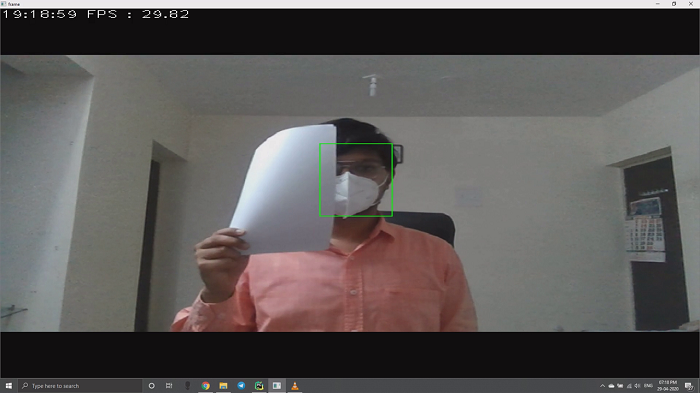
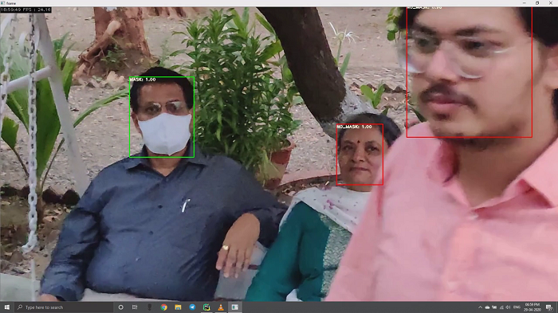
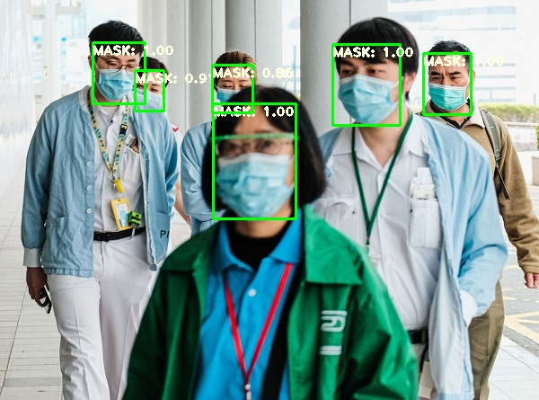
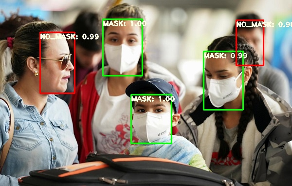
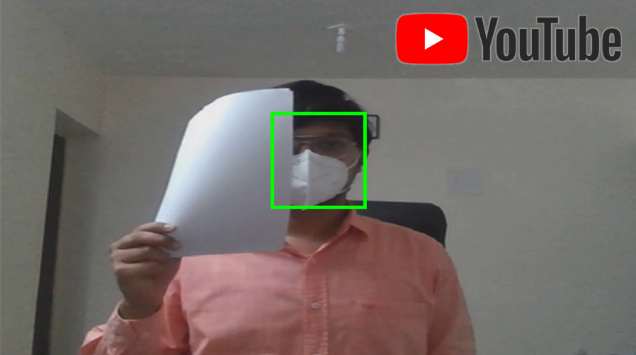

# FACE-MASK DETECTION
A minimal PyTorch implementation of YOLOv3, with support for training, interface & evalution.<br>
To train on custom dataset please visit my another [[GitRepo]]().

## ABSTARCT
### APPROCH
Standard YOLO V3 Approch is modified, and the table shows what change has been made.

|Standard YOLO Approch                          | Self-Modified YOLO Approch                       |
|-----------------------------------------------|--------------------------------------------------|
| 1. Object Detection Process                   | 1. Object Detection Process                      |
| ... 1.1. Localization                         | ... 1.1. Localization                            |
| ... 1.2. Class Prediction                     | ... 1.2. Class Prediction                        |
| 2. Thresholding                               | 2. Thresholding                                  |
| 3. Non max suppression with respect to Class  | 3. Non max suppression irrespective of class label|
||4. Bounding Box Labelling|

### REPORT
- Explanation : [explanation.md](explanation.md)
- You can check the full report of this project here... [[FACE-MASK DETECTION USING YOLO V3 ARCHITECTURE.pdf]](https://drive.google.com/file/d/1QFFEEtHlMsQHcgEiQYy4hlYvCam73KE5/view?usp=sharing)


## INSTALLATION
##### Clone and install requirements
    > git clone https://github.com/NisargPethani/Face-Mask-Detection-using-YOLO-v3.git
    > cd Face-Mask-Detection-using-YOLO-v3/
    > pip install -r requirements.txt


##### Checkpoints
Download checkpoint From [[GoogleDrive]](https://drive.google.com/drive/folders/1UlF6PmTwwd4cm-wD9v6Qy7gbC_tzif_j?usp=sharing) <br>
Copy `yolov3_ckpt_35.pth` into `checkpoints/`


## EVALUATION
Evaluates the model.

    > python validate.py --weights_path checkpoints/yolov3_ckpt_35.pth

Average Precisions:
| Class                   | AP                |
| ----------------------- |:-----------------:|
| Class '0' (MASK)        | 73.0              |
| Class '1' (NO_MASK)     | 83.3              |

mAP: 78.19

## DETECTION
### Real Time Detection
    > python cam_detect.py --weights_path checkpoints/yolov3_ckpt_35.pth
Some Screen-shots of Real-Time Detection is shown below 

<p align="center"></p>
<p align="center"></p>


### Detection in Image
Move inmages to `testing/input/images`

    > python image_detect.py --image_folder testing/input/images --weights_path checkpoints/yolov3_ckpt_35.pth

<p align="center"></p>
<p align="center"></p>


### Detection in Video
Make new directory with name: `'videos'` in `testing/input`<br>
Move videos to `testing/input/videos`

    > python video_detect.py --image_folder testing/input/videos --weights_path checkpoints/yolov3_ckpt_35.pth


## YOUTUBE 
Following YouTube video shows the output.
<a align="center" href="http://www.youtube.com/watch?feature=player_embedded&v=XOlOh3gs9K8
" target="_blank"><p align="center"></p></a>


## CREDIT
[[Paper]](https://pjreddie.com/media/files/papers/YOLOv3.pdf) [[Project Webpage]](https://pjreddie.com/darknet/yolo/) [[Authors' Implementation]](https://github.com/pjreddie/darknet)

```
@article{yolov3,
  title={YOLOv3: An Incremental Improvement},
  author={Redmon, Joseph and Farhadi, Ali},
  journal = {arXiv},
  year={2018}
}
```

Also Help is taken from [[GitRepo]](https://github.com/eriklindernoren/PyTorch-YOLOv3.git)