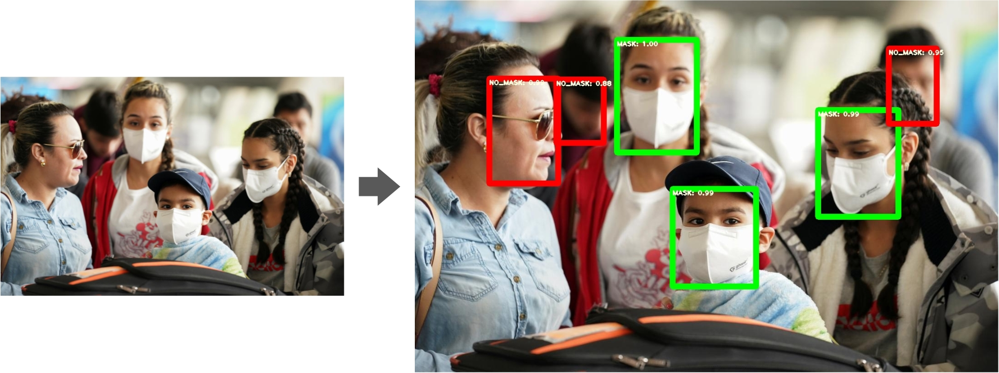
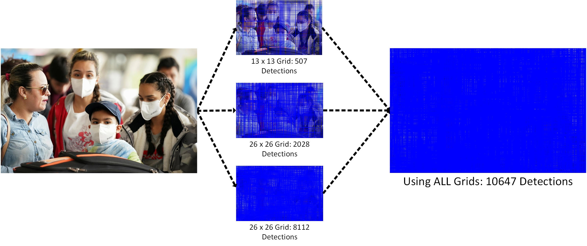
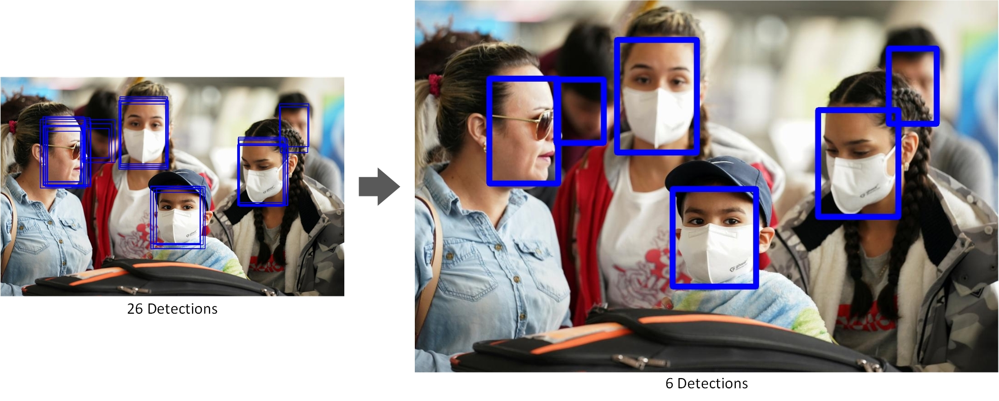
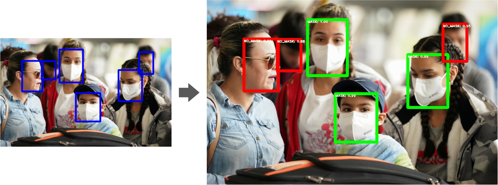

# Explanation

- Object Detection Process
    - **Localization**
    - **Class Prediction**

    

- Thresholding

    

- Non max suppression irrespective of class label

    

- Bounding Box Labelling

    